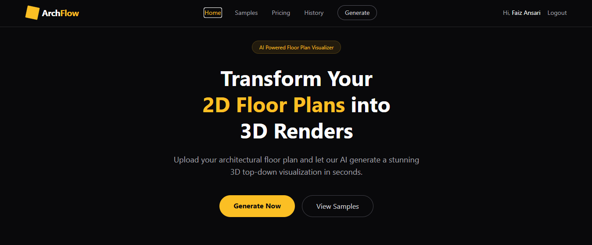
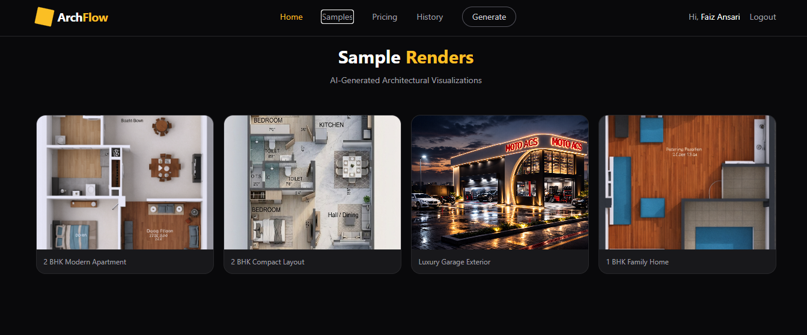
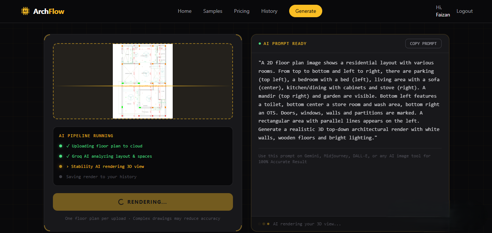
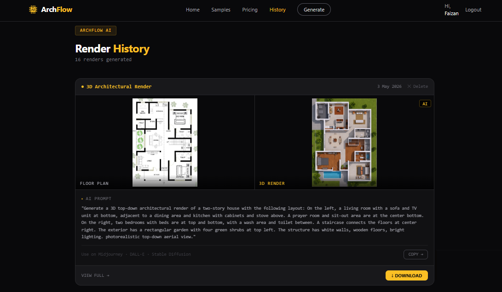
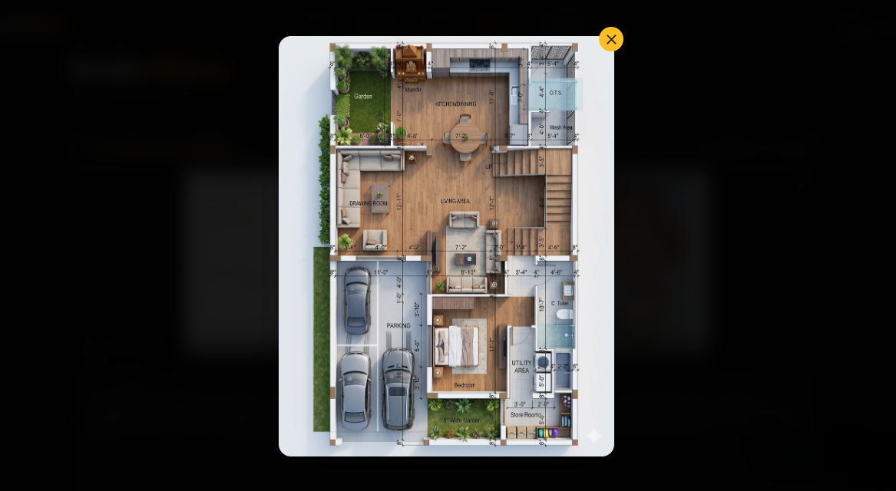

>  This is the Backend repository. Frontend repo: [archflow](https://github.com/faezur/archflow)

# ArchFlow — AI Floor Plan Analyzer

> ArchFlow is an AI-powered system that converts 2D floor plans into intelligent, structured architectural visualizations. It helps users quickly understand spatial layouts by generating realistic top-down renders from simple floor plan images.

[](https://arch-flow-mu.vercel.app)
[](https://github.com/faezur/archflow)
[](https://github.com/faezur/archflow-backend)

---

## 🔗 Links
- **Live Demo:** [arch-flow-mu.vercel.app](https://arch-flow-mu.vercel.app)
- **Frontend Repo:** [github.com/faezur/archflow](https://github.com/faezur/archflow)
- **Backend Repo:** [github.com/faezur/archflow-backend](https://github.com/faezur/archflow-backend)

---

## 📸 Screenshots

### Home Page


### Sample Page


### Generate Page


### History Page


### 3D Render Result


---

## 🚀 Features

- 📤 **Floor Plan Upload** — Upload 2D plans via drag & drop or file selection  
- 🤖 **AI-Powered Analysis** — Detects rooms, layout, and spatial relationships  
- 🏗️ **3D Render Generation** — Generates realistic architectural visualizations  
- 🔐 **Secure Authentication** — JWT-based login & signup system  
- 🌐 **Google OAuth** — One-click login with Google  
- 🗂️ **Render History** — Save, view, download, and delete past renders  
- 🔄 **Compare Slider** — Compare original vs generated output  
- ☁️ **Cloud Storage** — Secure image storage using Cloudinary  
- 📱 **Responsive UI** — Optimized for all devices  
- ⚡ **Retry Logic** — Handles API failures and rate limits automatically  

---

##  Tech Stack

| Category | Technology |
|----------|-----------|
| Frontend | React, Vite, Tailwind CSS, React Router |
| Backend | Node.js, Express.js |
| Database | MongoDB Atlas, Mongoose |
| Auth | JWT, bcryptjs, Passport.js, Google OAuth 2.0 |
| AI | Vision AI Analysis, Image Generation AI |
| Storage | Cloudinary, Multer |
| Deploy | Vercel (Frontend), Render.com (Backend) |

---

##  AI Flow

```
1. User uploads 2D floor plan image
        ↓
2. Image saved to cloud storage
        ↓
3. AI analyzes floor plan
   → Identifies rooms & positions
   → Reads dimensions
   → Maps furniture per room type
        ↓
4. Detailed prompt generated
        ↓
5. AI generates photorealistic 3D render
        ↓
6. Generated image saved to cloud
        ↓
7. Result saved to database & displayed
```

---

##  API Endpoints

| Method | Endpoint | Auth | Description |
|--------|----------|------|-------------|
| POST | `/api/auth/register` | No | Register user |
| POST | `/api/auth/login` | No | Login user |
| GET | `/api/auth/google` | No | Google OAuth |
| GET | `/api/auth/google/callback` | No | Google callback |
| GET | `/api/auth/me` | Bearer | Get current user |
| POST | `/api/generate` | Bearer | Create render |
| GET | `/api/generate` | Bearer | Get all renders |
| DELETE | `/api/generate/:id` | Bearer | Delete render |

---

##  Deployment

| Service | Platform |
|---------|----------|
| Frontend | Vercel |
| Backend | Render.com |
| Database | MongoDB Atlas |

---

##  Author

**Faiz Ansari**
- GitHub: [@faezur](https://github.com/faezur)
- Email: faezur@gmail.com
- LinkedIn: [linkedin.com/in/faizansari](https://linkedin.com/in/faizansari)

---

## 📄 License

MIT License
